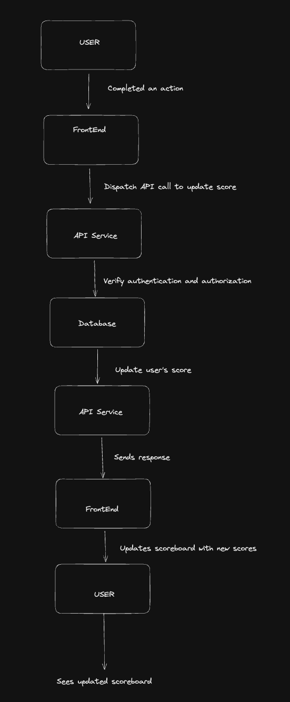

# Module Specification: Scoreboard API Service

The Scoreboard API Service is responsible for managing the user scores and providing live updates to the scoreboard. This module ensures that only authorized users can update their scores and prevents unauthorized users from increasing scores.

# Functionality

- Retrieve the top 10 user scores for the scoreboard.
- Update a user's score upon completion of an action.
- Authenticate and authorize users to prevent unauthorized score updates.

# API Endpoints

## 1. GET `/scores`

- Description: Retrieves the top 10 user scores.
- Response:
  - Status Code: `200 OK`
  - Body: An array of user scores in descending order.

## 2. POST `/scores`

- Description: Updates a user's score.
- Request:
  - Body: User ID and the score increase amount.
- Response:
  - Status Code: 200 OK if the score is updated successfully.
  - Status Code: 401 Unauthorized if the user is not authenticated.
  - Status Code: 403 Forbidden if the user is not authorized to update the score.

# Authentication and Authorization

The Scoreboard API Service implements authentication and authorization to prevent unauthorized score updates. The following mechanisms are in place:

- `Authentication`: Users must provide a valid access token in the request header for authentication. This access token is obtained through a separate authentication process.
- `Authorization`: Only users with the necessary permissions can update their scores. The access token contains the necessary information to determine the user's permissions.

# Flow of Execution

Here is a diagram illustrating the flow of execution in the Scoreboard API Service:

# Additional Comments

- It is recommended to use a secure connection (HTTPS) for API communication to protect sensitive data such as access tokens.
- Implement rate limiting and request throttling mechanisms to prevent abuse and ensure fair usage of the API.
- Consider implementing caching mechanisms to improve performance and reduce load on the database.
- Perform input validation and sanitization on user inputs to prevent security vulnerabilities such as SQL injection and cross-site scripting (XSS) attacks.
- Implement comprehensive logging and monitoring to track API usage, identify potential issues, and ensure system stability and performance.
- Consider implementing a comprehensive testing strategy, including unit tests, integration tests, and end-to-end tests.
- Consider using WebSockets for real-time updates to the scoreboard, allowing users to see score changes without manually refreshing the page.
